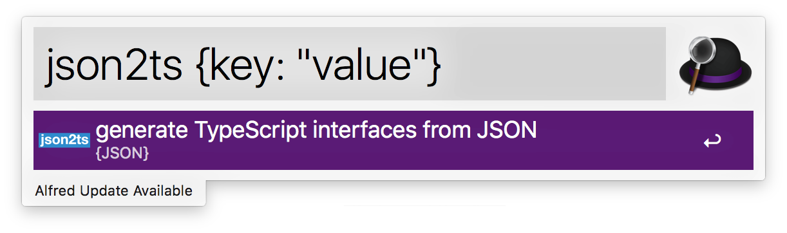

# json2ts Workflow for [Alfred 3](http://www.alfredapp.com)

generate TypeScript interfaces from json

[Download](https://github.com/uzimith/json2ts-alfredworkflow/releases/download/untagged-4e8c7b0efb7a20cad5e1/json2ts.alfredworkflow)

## URL

-   This workfow call API from [json2ts](http://json2ts.com/#)
